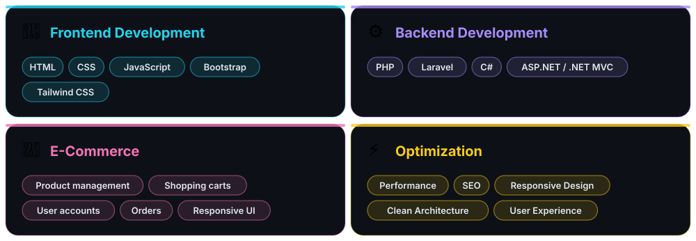
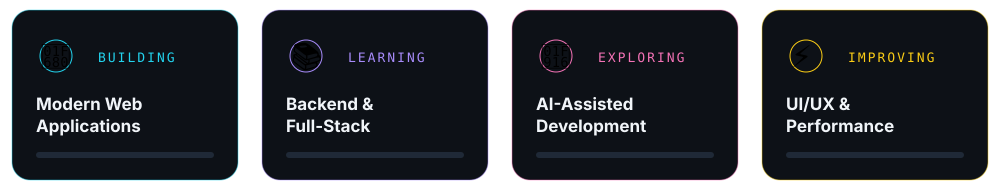

  

### ⚡ About Me

  I'm a <strong>Web Designer & Developer</strong> focused on creating modern, responsive and user-focused digital experiences. 
  I enjoy turning ideas into real-world web apps with clean interfaces, scalable architecture and a strong eye for performance and UX.

  <strong>🎨 UI/UX</strong> &nbsp;•&nbsp; <strong>💻 Web Development</strong> &nbsp;•&nbsp; <strong>⚙️ Backend</strong> &nbsp;•&nbsp; <strong>🚀 Performance</strong> &nbsp;•&nbsp; <strong>🤖 AI</strong> &nbsp;•&nbsp; <strong>🔍 SEO</strong>

---

### 🧠 Tech Stack

### Frontend

### Backend

### CMS & Tools

---

### 🚀 What I Build

### 💼 Featured Projects

<table>
<tr>
<td align="center">

</td>
<td align="center">

</td>
</tr>
<tr>
<td align="center">

</td>
<td align="center">

</td>
</tr>
</table>

### 🎯 Currently
 
### 🐍 Contribution Snake

  

 

